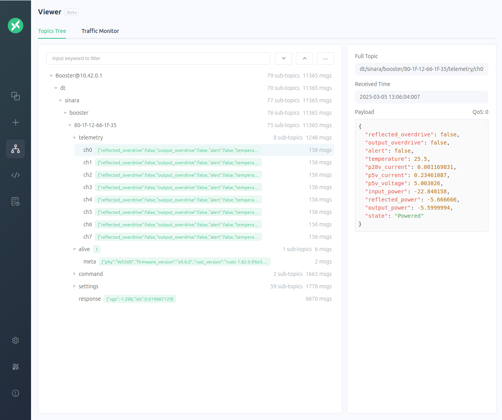
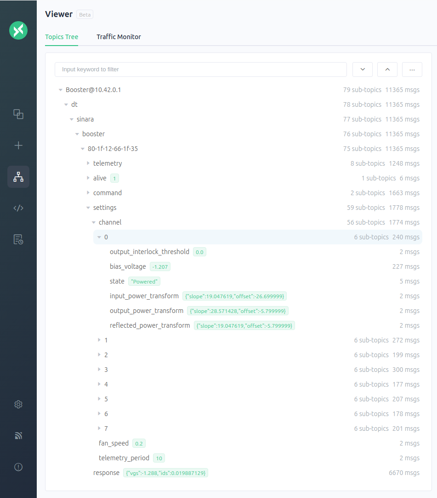
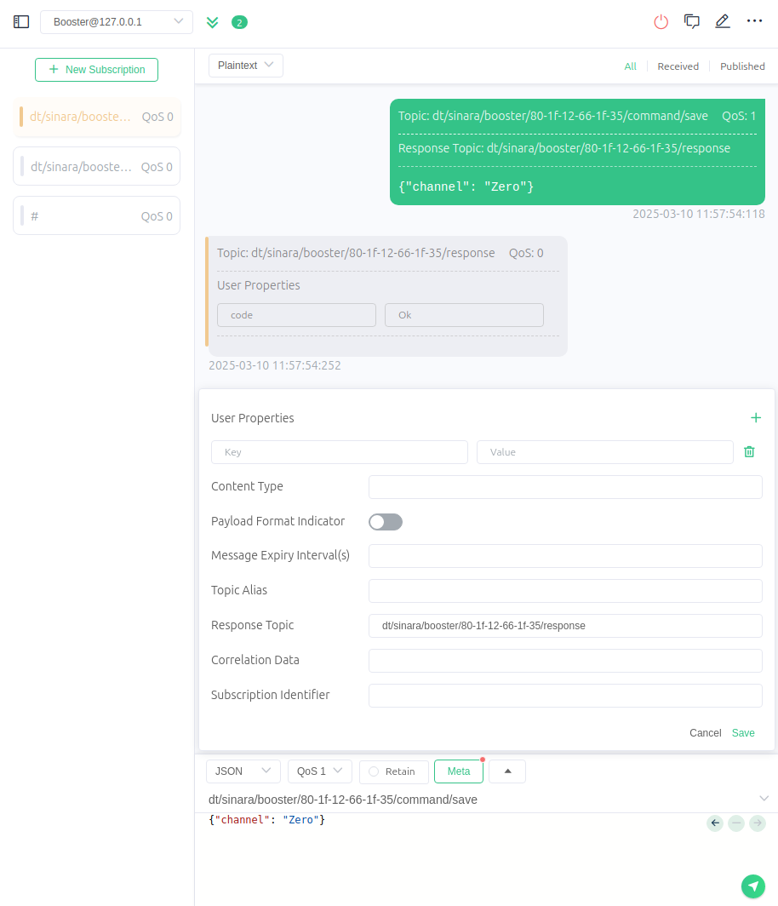

# Ethernet Telemetry and Control

<-- TOC -->

Booster uses MQTT for telemetry reporting, settings configuration, and control of the channels. All
booster MQTT topics are prefixed with `dt/sinara/booster/<ID>`, where <ID> is the MAC address of the
device by default(e.g. `12-34-56-78-90-ab`). The ID is configurable via the USB port.

Please refer to [Stabilizer's documentation](https://quartiq.de/stabilizer/setup.html#mqtt-broker)
for instructions on getting MQTT configured.

We recommend using [MQTTX](https://mqttx.app/) to view telemetry and run-time
settings.

## Measurement Units

Booster uses SI units (Volt, Ampere, Celsius) for telemetry and settings. Power measurements are
specified in dBm.


## Telemetry

Telemetry is generated on the
`<prefix>/telemetry/ch<N>` topics, where N is an integer from 0 to 7. Telemetry is only reported for
connected channels. Telemetry is transmitted in human-readable JSON format for logging purposes.




_Figure 1_: Example display of Booster telemetry on all 8 channels reported via MQTTX.

## Settings

Booster leverages [`miniconf`](https://crates.io/crates/miniconf) to manage run-time settings and
configuration identical to Stabilizer. Please refer to [Stabilizer's Miniconf
Documentation](https://quartiq.de/stabilizer/usage.html#miniconf-run-time-settings) to get
started.

When settings are saved in booster, the saved channel configuration will be applied to
the channel when Booster boots. Note that saving channel settings overwrites any existing channel
configuration and calibrations including those from the old legacy firmware. The legacy firmware
settings are incompatible.



_Figure 2_: Example display of Booster settings tree reported via MQTTX.

For saving settings via MQTT, the `<prefix>/command/save` topic is used. The payload should be a JSON
containing the channel ID, e.g. `{"channel": "Zero"}`. Additionally, a response topic must be set,
e.g. `<prefix>/response`, to receive the response code from the device, otherwise the save command
is not executed.



_Figure 3_: Example display of saving settings for channel zero via MQTTX.

## Control

Booster supports channel bias tuning and saving active channel settings configuration to EEPROM
via the Booster python package located in the `py` folder of the repository. Execute the
following to install the package and see how to use it:
```sh
pip install ./py
python -m booster --help
```
