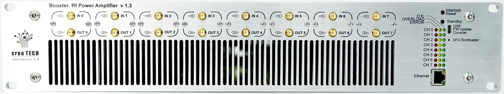

# Booster NGFW (Next-Generation Firmware) User Manual

This document is intended to provide an overview of the Booster NG firmware, which is a rewrite of
Booster firmware to align it with other projects, resolve qualify issues, and enable continued
maintenance and improvements.

The firmware is offered as an option to Booster and licensed on a restrictive
per-device basis with redistribution and reuse prohibited. End users obtain
access to the source code to modify it but the number of installed instances is
limited and certified. Once the development and maintenance investments have
been recovered the firmware will be offered under an open source license.

# Hardware

Booster is an 8 channel RF power amplifier in the Sinara open hardware ecosystem.
The open hardware designs and hardware discussions are located at
https://github.com/sinara-hw/Booster/wiki.
The hardware is available from Creotech, QUARTIQ, Technosyste, and M-Labs.

# Getting Started

This section is intended to acquaint the user with the Booster NGFW application.

There are three ways to interface with the Booster application:
1. Pressing any of two the front-panel buttons
1. Communicating with Booster over the USB port
1. Communicating with Booster over ethernet via MQTT
